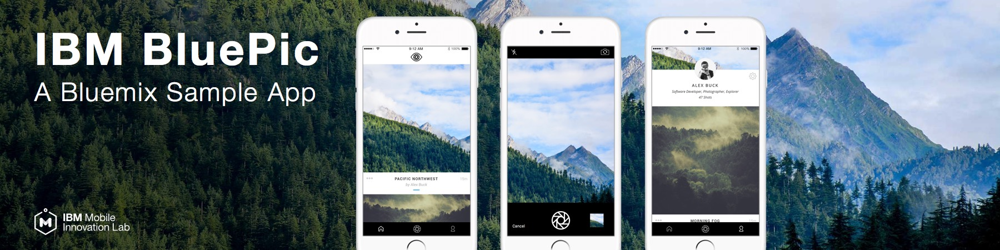
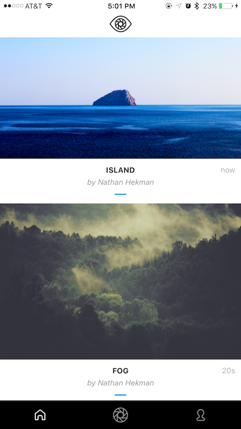
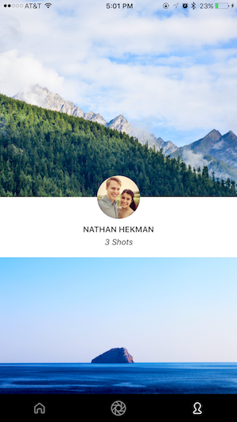
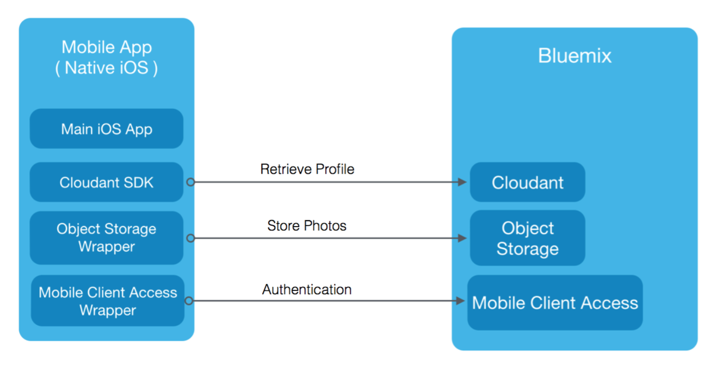

<p align="center">

</p>


##Introducing BluePic

Here at [IBM’s Mobile Innovation Lab](http://www-969.ibm.com/innovation/milab/) in Austin, TX, we were recently given the opportunity to play around with various Bluemix services to build a starter Bluemix app. A goal of ours was to build a modern, beautiful, and social native iOS application written in Swift that takes advantage of the performance and scalability of Bluemix. As a result, we created BluePic-- a photo sharing app that allows users to upload photos from their iOS device to a global feed where anyone can see everyones images.

Users are able to authenticate with Facebook, add captions to photos, as well as see a feed of all the photos they've taken on their Profile. BluePic is an excellent example of how easy it is to get started with Bluemix, and shows how anyone can build modern, social, and scalable mobile applications quickly and easily.

  
<p align="center">Figure 1. BluePic's UI.</p>


##Open Source

BluePic is fully open sourced on Github and can be found [here](https://github.com/IBM-MIL/BluePic).  BluePic's source code illustrates best practices of an iOS app architecture using Bluemix services. Included in this Github repository are all the steps you need to get started and get BluePic running on your own Bluemix instance!

## A Bluemix Architecture
BluePic takes advantage of few Bluemix services such as Mobile Client Access, Cloudant, and Object Storage as shown in the architecture diagram below.

<p align="center">
</p>
<p align="center">Figure 2. BluePic Architecture Diagram.</p>


###1. Mobile Client Access Facebook Authentication

[Bluemix Mobile Client Access Facebook Authentication](https://travis-ci.org/IBM-MIL/BluePic.svg?branch=master) is used for logging into BluePic. Getting up and running with Facebook authentication was straightforward. After creating an application for BluePic on the Facebook web portal, you import the Bluemix Facebook Authentication framework, and configure a few lines in the AppDelegate as shown below.
<br>

```swift
func applicationDidBecomeActive(application: UIApplication) {
	FBAppEvents.activateApp()
}
    
func application(application: UIApplication, openURL url: NSURL, sourceApplication: String?,annotation: AnyObject) -> Bool {
	return FBAppCall.handleOpenURL(url, sourceApplication:sourceApplication)
}
```

To see the full description of implementing Facebook authentication into BluePic, check out [this link](https://github.com/IBM-MIL/BluePic#1-mobile-client-access-facebook-authentication)

###2. Cloudant Sync (CDTDatastore)

Cloudant Sync ([CDTDatastore](https://github.com/cloudant/CDTDatastore)) enables you to create a single local database for every user. The app simply replicates and syncs a copy of the remote database in Cloudant with its local copy on the user's phone or tablet. If there’s no network connection, the app runs off the local database on the device. In BluePic we have two types of documents: profile and picture. Note that we only store the metadata for pictures, the actual image is stored in the Object Storage Bluemix service. 

The snippets below illustrate creating a local datastore and Profile document with CDTDatastore.

Creating a local datastore:

```swift
/*Creates a local datastore with the specific name stored in dbName instance variable.     */

func createLocalDatastore() throws {
	let fileManager = NSFileManager.defaultManager()
	let documentsDir = fileManager.URLsForDirectory(.DocumentDirectory, inDomains: .UserDomainMask).last!
	let storeURL = documentsDir.URLByAppendingPathComponent("cloudant-sync-datastore")
	let path = storeURL.path
	self.manager = try CDTDatastoreManager(directory: path)
	self.datastore = try manager.datastoreNamed(dbName)
}
```
Method to create a Profile document:

```swift
/* Creates a profile document.
 * @param id Unique ID the created document to have.     
 * @param name Profile name for the created document.     
 */
    
func createProfileDoc(id:String, name:String) throws -> Void {
	// Create a document
	let rev = CDTDocumentRevision(docId: id)
	rev.body = ["profile_name":name, "Type":"profile"]
	// Save the document to the datastore
	try datastore.createDocumentFromRevision(rev)
	print("Created profile doc with id: \(id)")
}
```

You can see more details about CDTDatastore implementation in BluePic [here](https://github.com/IBM-MIL/BluePic#2-cloudant-sync-cdtdatastore)

###3. Object Storage
[Object Storage](https://console.ng.bluemix.net/catalog/services/object-storage/) is used in BluePic for hosting images.
ObjectStorageDataManager and ObjectStorageClient were created based on [this link](http://developer.openstack.org/api-ref-objectstorage-v1.html) for communicating between iOS and Object Storage.

Below shows a simple example method of uploading a photo to Object Storage in BluePic.

```swift
/**Method called to upload the image to object storage*/

func uploadImageToObjectStorage() {
	print("uploading photo to object storage...")
   //push to object storage
	ObjectStorageDataManager.SharedInstance.objectStorageClient.uploadImage(FacebookDataManager.SharedInstance.fbUniqueUserID!, imageName: self.lastPhotoTakenName, image: self.lastPhotoTaken,
            onSuccess: { (imageURL: String) in
                print("upload to object storage succeeded.")
                print("imageURL: \(imageURL)")
            }, onFailure: { (error) in
                print("upload to object storage failed!")
                print("error: \(error)")
                DataManagerCalbackCoordinator.SharedInstance.sendNotification(DataManagerNotification.ObjectStorageUploadError)
     })
}

```

To see more about Object Storage implementation in BluePic, go [here](https://github.com/IBM-MIL/BluePic#3-object-storage)


##Final Thoughts
That's it! We encourage you to check out BluePic for yourself by exploring the [Github](https://github.com/IBM-MIL/BluePic) repository and cloning the project. We hope you can use BluePic as a starting point to write your own modern Swift applications using Bluemix and to create an amazing app of your own!